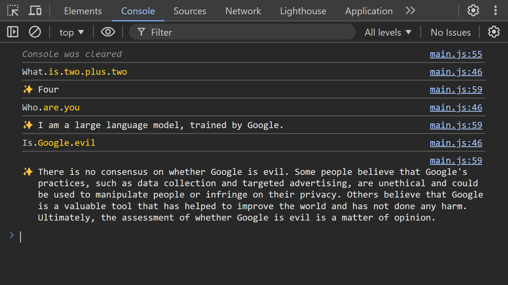

# DevTools Chatbot

An AI chatbot in the Chrome DevTools JavaScript console. Uses Chrome's experimental [Prompt API](https://github.com/explainers-by-googlers/prompt-api#readme) (a.k.a. [Chrome Built-in AI](https://developer.chrome.com/docs/ai/built-in)), which is a small Large Language Model like ChatGPT, built directly into the browser.

[benjaminaster.com/devtools-chatbot](https://benjaminaster.com/devtools-chatbot/)

